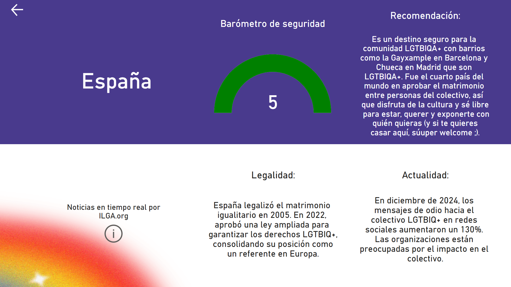

# 🌈 Final Project Module 4 - Proud Travelers 

This project was developed by **Marta Gamarra**, **Marina Gascó**, **Ariana Papantonio**, and **Verónica Sánchez** as part of **Module 4: Data Visualization | Power BI & Tableau** in the **Adalab Data Analytics Bootcamp**.

Our goal was to explore and clean data, strength our **ETL** and **data visualization** skills and create impactful visualizations with **Tableau** or **Power BI** to communicate insights effectively.  

---

## 📌 Project Overview

**Proud Travelers** is a data-driven project designed to help LGTBIQA+ individuals explore the world more safely and informed.  
Our aim was to visualize the current state of LGTBIQA+ legal protections, safety levels, and social trends around the globe — in a clear, accessible way.

We combined data cleaning and analysis with engaging visualizations to create an informative and interactive experience.

---

## 🛠️ Tools & Technologies

- **Python** for data cleaning (EDA) and preprocessing  
- **Pandas & NumPy** for data manipulation  
- **Power BI** for data visualization and dashboard creation  
- External data sources like ILGA.org and global human rights indexes

---

## 🔍 Data Sources

We gathered information from various public datasets, such as:
- International legal indexes related to LGTBIQA+ rights
- Country-level metrics on equality, safety, and legal protections
- Social trends and incidents (e.g. hate speech data from recent years)

---

## 📊 Dashboard Highlights

### 🇪🇸 Country Detail View

Each country page (like Spain) includes:
- A **Security Barometer**
- **Legal Status** summary
- Recent **social trends** or events
- A personalized travel **recommendation**

---

### 🗺️ Legal Landscape Map

Visualizes how much progress different regions have made in LGTBIQA+ legislation, categorized from 1 to 9 based on legal conditions.

---

### 🛡️ Safety Map

An intuitive, color-coded world map that communicates safety levels for LGTBIQA+ travelers based on legal and social indicators.

---

### 😊 Happiness & Equality Analysis

Explores the correlation between happiness and parameters like:
- Life expectancy
- Education
- LGTBIQA+ rights
- Social protection

---

## 👩‍💻 Team

This project was developed during the **Adalab Data Analytics Bootcamp** by our team, using real-world data challenges to practice EDA and storytelling through visualizations.

---

## 💬 Want to contribute or use this?

Feel free to fork or clone the repo. Data sources are cited in our code, and all visuals were generated with Power BI based on cleaned data in Python.

---

